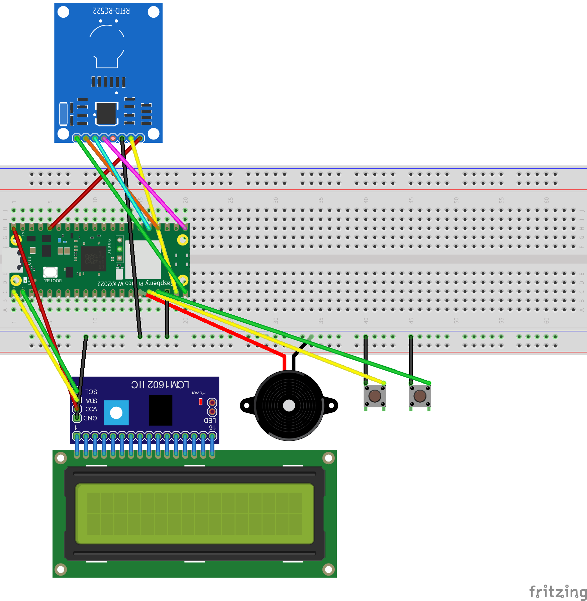
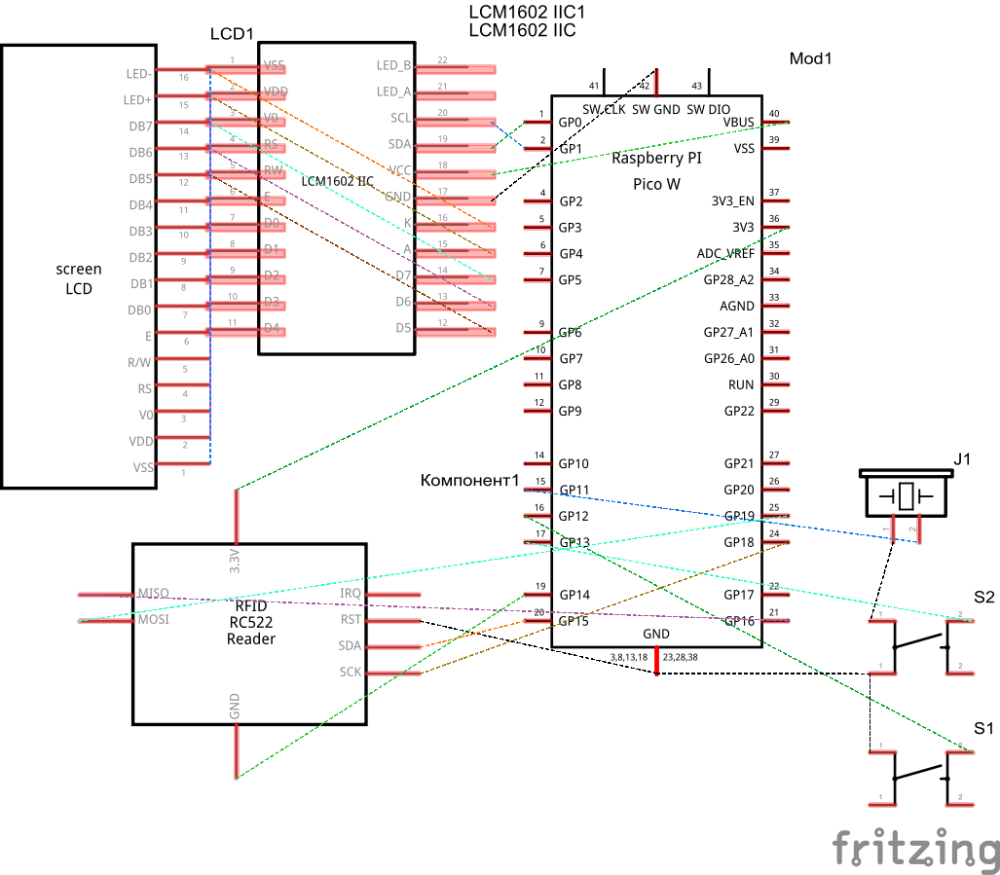

<h1 align="center" id="title">Music Box Controller</h1>

## 🖥️ Compatibility

- Tested on **Raspberry Pi Pico W**
- Any microcontroller with MicroPython should work in theory

## 🛠️ Installation

1. Clone the repository `git clone https://github.com/MusicBoxRaspberryPi/MusicBoxController`
2. Rename `config.py.dist` to `config.py`
3. Edit `config.py` to your needs
4. Copy contents of `src` to your microcontroller

## 🚀 Usage

- **Left button** - Previous device
- **Right button** - Next device
- **RFID Scan** - Play track
